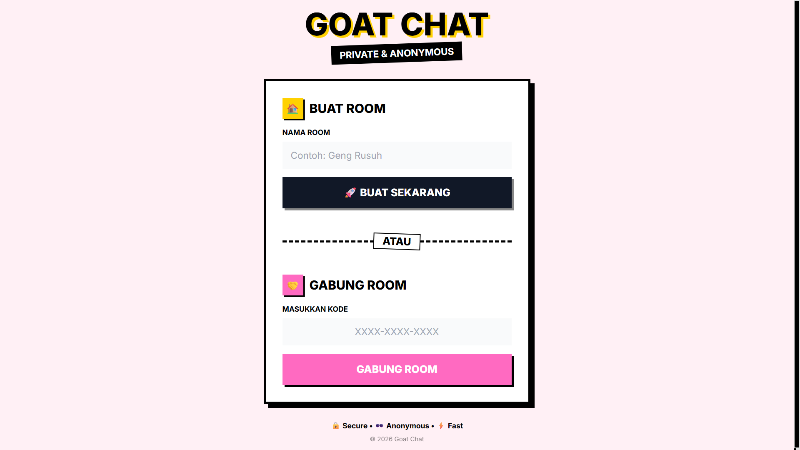
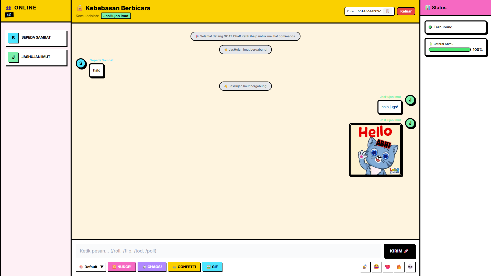
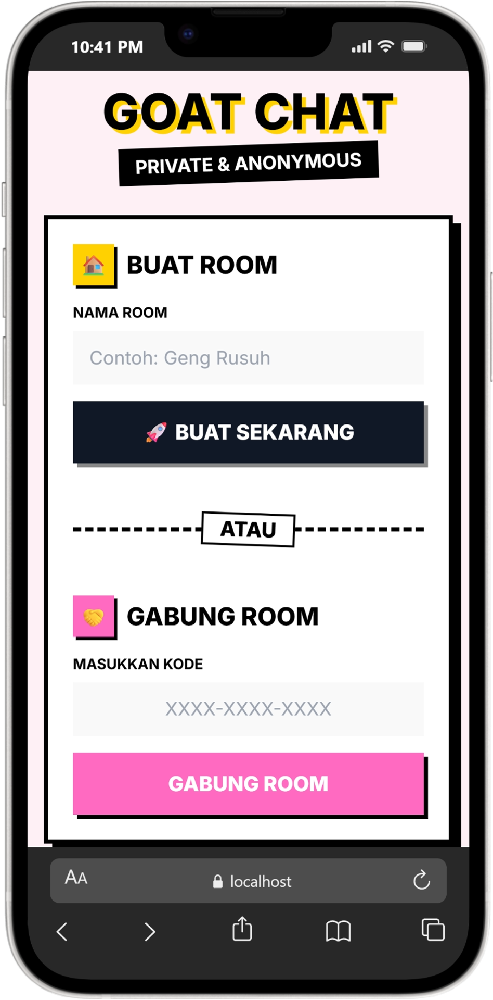
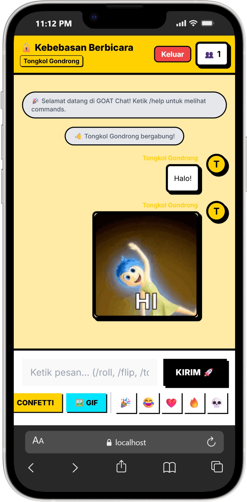

# 🐐 GOAT Chat (Greatest of All Time Private Chat)

> **"Apa yang terjadi di RAM, tetap di RAM."**



GOAT Chat adalah platform pesan instan ultra-privat, berkinerja tinggi, dan real-time yang dirancang untuk mereka yang paranoid namun suka kekacauan. Dibangun dengan **GOAT Stack** (Go, Alpine, Templ, Tailwind), aplikasi ini berjalan sepenuhnya di memori (in-memory) tanpa database.

**Nol Log. Nol Penyimpanan. Maksimum Chaos.**

[](https://opensource.org/licenses/MIT)
[](https://go.dev/)
[](https://github.com/muhmuslimabdulj/goat-chat/actions)
[](./Dockerfile)
---

## Kenapa GOAT Chat?

Di era pengawasan massal dan penambangan data, GOAT Chat menawarkan tempat perlindungan untuk komunikasi sementara.

### Privasi Secara Arsitektur
- **Tanpa Database**: Tidak ada SQL, NoSQL, atau penyimpanan disk. Begitu server restart, setiap pesan, room, dan identitas pengguna musnah seketika.
- **Hanya RAM**: Semua state (data) hidup di memori volatile server.
- **Tanpa Daftar**: Tanpa email, tanpa nomor HP. Cukup generate persona unik dan mulai chat.
- **Anti-Forensik**: Bahkan jika server disita secara fisik, tidak ada log pesan yang bisa dipulihkan.

### Chaos & Fun
Ini bukan Slack korporat yang membosankan. Ini didesain untuk percakapan seru dan hidup.
- **Chaos Mode**: Picu lampu disko dan layar berguncang untuk semua orang di dalam room.
- **Nudge/Getar**: Ganggu teman Anda dengan menggetarkan perangkat/layar mereka.
- **Perintah Interaktif**: `/roll` (dadu), `/flip` (balik teks), `/spin`, `/tod` (Truth or Dare).
- **Nonton Bareng**: Sinkronisasi pemutaran YouTube dengan semua orang di room (Mode Nobar).

### Performa Ngebut
- **Go Backend**: Menangani ribuan koneksi WebSocket secara bersamaan dengan enteng.
- **Sangat Ringan**: Bisa jalan di pemanggang roti (atau STB B860H dengan RAM 1GB).
- **Pendekatan ala HTMX**: Menggunakan Alpine.js untuk JavaScript client-side yang minimalis namun reaktif.

---

## Tangkapan Layar

| Lobby & Generate Persona | Real-time Room |
|--------------------------|----------------|
|  |  |

| Lobby Mobile Version | Room Mobile Version |
|---------------------|---------------------|
|  |  |

---

## The GOAT Stack

Sederhana, cepat, dan type-safe.

- **Backend**: [Go (Golang)](https://go.dev/) 1.23+
  - `Gorilla/WebSocket` untuk komunikasi real-time.
  - `a-h/templ` untuk server-side rendering yang type-safe.
- **Frontend**: [Alpine.js](https://alpinejs.dev/)
  - Reaktivitas ringan tanpa build step ribet ala React/Vue.
- **Styling**: [Tailwind CSS](https://tailwindcss.com/)
  - Sistem desain Neo-Brutalism kustom.
- **Mobile**: [Capacitor](https://capacitorjs.com/)
  - Mengubah web app ini menjadi aplikasi Android native (APK).

### Arsitektur

```text
       User
      /    \
     v      v
  Browser  Android
     \      /
      v    v
   UI (Alpine)
      |  |
      |  +-- WebSocket --> [ WebSocket Hub ] <--> [ Chaos Engine ]
      |
      +----- HTTP -------> [ Go Server ] ----> [ Templ Renderer ]
```

---

## Memulai (Getting Started)

### Prasyarat
- Go 1.23 atau lebih baru
- Node.js & npm
- Make

### Mulai Cepat (Local Development)

1.  **Clone repository**
    ```bash
    git clone https://github.com/mmuslimabdulj/goat-chat.git
    cd goat-chat
    ```

2.  **Install tools & dependencies**
    ```bash
    make install
    ```

3.  **Jalankan aplikasi**
    ```bash
    make dev
    ```
    Perintah ini menjalankan:
    - Air (Hot reload untuk Go)
    - Tailwind CLI (Watch mode untuk CSS)
    - Templ proxy

4.  **Buka Browser**
    Kunjungi `http://localhost:8080`

### Menjalankan dengan Docker

```bash
docker build -t goat-chat .
docker run -p 8080:8080 -e ALLOWED_ORIGINS="*" goat-chat
```

---

## Aplikasi Mobile (Android)

Ubah server chat ini menjadi aplikasi mobile (APK) menggunakan **Capacitor JS**.

### Bagaimana Cara Kerjanya?
GOAT Chat menggunakan Capacitor untuk memungkus web app (Alpine.js + Tailwind) ke dalam Webview Android native. Ini memungkinkan kita mengakses fitur native melalui plugin JavaScript.

### Plugin yang Digunakan
- **App**: Menangani state aplikasi (resume/pause) dan URL scheme.
- **Haptics**: Memberikan feedback getaran saat menerima "Nudge" atau notifikasi.
- **Share**: Fitur native share untuk membagikan Link Invite room.

### Langkah Build APK

1.  **Set URL Server**
    Pastikan file `.env` memiliki URL server tujuan (lokal atau production):
    ```env
    CAPACITOR_SERVER_URL=https://your-server.com
    # Atau untuk dev lokal via emulator:
    # CAPACITOR_SERVER_URL=http://10.0.2.2:8080
    ```

2.  **Jalankan Script Build**
    Gunakan script otomatis yang sudah disediakan untuk sync, generate assets, dan build Gradle:
    ```bash
    bash scripts/android/build_apk.sh
    ```
    Output: `android/app/build/outputs/apk/debug/app-debug.apk`

3.  **Alternatif Manual (Jika perlu)**
    ```bash
    # Build aset web
    make build
    
    # Sync & Generate Assets
    bash scripts/android/prepare_android.sh
    
    # Compile
    cd android
    ./gradlew assembleDebug
    ```
    Output: `android/app/build/outputs/apk/debug/app-debug.apk`

> **Catatan**: Untuk panduan instalasi environment (Java/SDK) yang lengkap, lihat [ANDROID_SETUP.md](./ANDROID_SETUP.md).

---

## Deployment

GOAT Chat dirancang untuk bisa dideploy di mana saja yang bisa menjalankan binary Linux atau Docker container.

### Platform yang Didukung
- **Linux / VPS / STB**: Cukup copy binary dan jalankan.
- **Koyeb / Render / Railway**: Dockerfile sudah siap.
- **Raspberry Pi**: Kompatibel dengan ARM64.

Panduan detail untuk:
- Setup Service di STB/Linux
- Cloud Deploy di Render.com
- Cloud Deploy di Koyeb (dengan fix WebSocket)

👉 **Baca panduan lengkap di [DEPLOYMENT.md](./DEPLOYMENT.md)**

---

## Konfigurasi

Aplikasi dikonfigurasi melalui Environment Variables atau file `.env`.

| Variabel | Deskripsi | Default |
|----------|-------------|---------|
| `PORT` | Port HTTP server | `8080` |
| `ALLOWED_ORIGINS` | Whitelist CORS/WebSocket Origin (pisahkan koma) | `http://localhost:8080` |
| `SESSION_TTL_HOURS` | Berapa lama sesi user bertahan di memori | `24` |
| `RATE_LIMIT_API` | Request API per detik per IP | `10` |
| `RATE_LIMIT_WS` | Pesan WebSocket per detik per user | `5` |
| `RATE_LIMIT_STRICT` | Rate limit ketat untuk endpoint sensitif | `2` |
| `LOG_LEVEL` | Tingkat detail log (`debug`, `info`, `silent`) | `info` |
| `MAX_MESSAGE_SIZE` | Ukuran maksimal pesan WebSocket (bytes) | `4096` |
| `MAX_HISTORY_SIZE` | Jumlah pesan yang disimpan di history room | `200` |
| `GIPHY_API_KEY` | API Key untuk fitur pencarian GIF | *(kosong)* |
| `CAPACITOR_SERVER_URL` | URL server untuk build APK Android | *(wajib saat build)* |

**Tips Production**: Set `ALLOWED_ORIGINS="*"` atau domain spesifik Anda untuk menghindari error 403 Forbidden pada WebSocket, terutama saat deploy di PaaS seperti Koyeb.

---

## Struktur Proyek

```
goat-chat/
├── cmd/
│   └── server/       # Titik masuk aplikasi (main.go)
├── internal/
│   ├── config/       # Parsing env var & konfigurasi sistem
│   ├── delivery/     # Layer transport
│   │   ├── http/     # HTTP Handlers (REST & Web serving)
│   │   └── ws/       # WebSocket Hub, Client, & Logic
│   ├── domain/       # Struct bisnis inti (Room, User, Message)
│   ├── middleware/   # Middleware HTTP (Auth, Rate Limit, CORS)
│   └── usecase/      # Logika bisnis (Persona Generator, dll)
├── view/             # Template Templ (.templ)
│   ├── components/   # Komponen UI reusable (ChatBubble, Player)
│   ├── layouts/      # Layout dasar HTML (Base)
│   └── pages/        # Halaman utama (Lobby, Room)
├── static/           # Aset publik statis
│   ├── css/          # File CSS (Tailwind output)
│   ├── js/           # Logika Frontend (Alpine.js modules)
│   └── images/       # Aset gambar
├── android/          # Proyek Android Capacitor
├── scripts/          # Helper scripts (build, run emulator)
├── .env.example      # Template environment variable
├── capacitor.config.ts # Konfigurasi Capacitor
├── Dockerfile        # Definisi build production
├── Makefile          # Skrip pengembangan/shortcut
```

---

## Berkontribusi

Pull request sangat diterima! Entah itu fitur "Chaos Mode" baru, animasi UI yang lebih halus, atau optimasi kode.

1.  Fork Proyek ini
2.  Buat Feature Branch Anda (`git checkout -b feature/FiturKeren`)
3.  Commit Perubahan Anda (`git commit -m 'Tambah FiturKeren'`)
4.  Push ke Branch (`git push origin feature/FiturKeren`)
5.  Buka Pull Request

---

## Lisensi

Didistribusikan di bawah Lisensi MIT. Lihat file `LICENSE` untuk informasi lebih lanjut.

---

<p align="center">
  Dibuat dengan ❤️ (dan sedikit rasa paranoid) oleh <a href="https://github.com/muhmuslimabdulj">muhmuslimabdulj</a>
</p>
